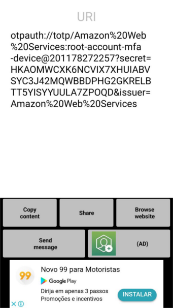

Como gerenciar minhas senhas?
###############################

:date: 2018-01-25 19:00
:tags: gpg, oathtool, pwgen, segurança, senhas
:category: Senhas
:slug: como-gerenciar-minhas-senhas
:author: Rafael Henrique da Silva Correia
:email:  rafael@abraseucodigo.com.br
:summary: Mostrando um pouquinho do gpg, oathtool e pwgen que eu uso para gerenciar minhas senhas

Esses dias em uma call no Hangout com alguns colegas estive falando sobre senhas, gpg, two-factor-authentication e essas coisas.

Eis que pensei que esse papo rápido deveria virar um post detalhado, pois percebi que muitos dos colegas que ali falavam comigo não conheciam algumas palavrinhas mágicas que eu estava falando.

Nesse post vou explicar o que EU faço para gerenciar minhas senhas, se vocês quiserem usar TUDO que eu falar aqui fiquem a vontade, a maioria das ferramentas aqui citadas funcionam lindamente em ambientes Linux, não faço ideia se vão funcionar em Mac OSX e Windows.

Como gerar senhas seguras?
--------------------------

Gosto bastante de um comandinho mágico chamado `pwgen` que é facilmente instalado pelo pacote de mesmo nome em sistemas Debian-like pelo comando apt-get:

.. code-block:: console

    $ sudo apt-get install pwgen

Este comando é muito simples de usar, basta abrir um terminar e digitar o seu respectivo nome:

.. code-block:: console

    $ pwgen
    ki8eTeef Acho1or1 oophuGh5 shawoe6F ahmi9ieG Iej3ohmi oS3unais ve0eiv5X
    iew5gaiP othai7Ch UFoh1eep naid5Sho Koo5Hai9 cohThaa8 eiBok1ae koofei8S
    Dae8Wai1 Pae1lo8u Iega7uah uNoawae8 Ood7uiN0 raiQu3ai wae6ca4U ohNg9aer
    Shahbio9 taeP9Oku weo7Rapa iu3yieC6 oThi2gen ahK4ahsa Dah3shei nai2Baiy
    ohz5Wur8 eeShee6x Ahyah0Be ieYo9Ail hoo6tooP aej7ToPh Veith3do Ro0fahv8
    Mie4meeK aeghooR0 sha6eeVo uc1Juish eeXui7le IeY5eiY5 queT7Iev Pha4ahvu
    eXah4ulu Oong9eig IoNgie9e Ieng0pie mah3Einu jeiwen6U bu5Ohw4d VeeXak2a
    bohse7uY EiJee2Ie xae0aiSh huo3Yei5 leCh7ezu Soh2thoh Chughei2 Yu7ahHed
    Audutee4 naN5aequ upu3Ka8z Choh6Chu nae9ic1E Heewuy7A quai5Te2 Oebai8ae
    ux0Xieng Hoong6pi Ezoh1aid eiVe1Ue2 IetaB3ei eib4Phee go6ooRee ool0aiWi
    uN4pua8y Icheiy5w EiK3aeci pae1Eej9 ao3Phaif Jeequoo3 uJ5doequ bu4Xooph
    eiGa1pha ahh6Ei0R Xai8thoo Quae4Iez AiMas9ew Ri3lahpi ahL6Eija ohyeih6A
    phe2Oor3 IaBaex6i bohTo0ba Ait0Uosh gaih1Bei Ohs7thei Ais1uejo UYah1shi
    oor7Eec3 pahgh7Ch ekie5aFu io0ohpuK aghai2Ba Hie4Aeb4 ohve9Chi Iev9Mu3H
    iej0aiNi OhCh5ied hie3ooGh eiguuJ1a zu7Aut6a Teen7owi eiy2Ahvu daCui2iv
    Uc4Dothi Emah2oht Suv6poi5 Eej3quoa Mooj8eim Teifu1ah ZuaDeez3 Ereoqu9I
    ua0juoTe Fash9eig eiY6Ohr0 Imie8jie dohJoh4t ieNg2coo XahQuu8s eereS0ri
    Da7yiyu1 zaepoo0A to0Aexoh gooxoh0D Aezoofo3 aeZ5oopo Shoo6iip aemahx0R
    Thay5gah aethu0Ph Yaedei4d ixur7Xoh Eidee8ri ata9oNoo yoox9Zee foow9Muz
    pah1Oe0w Xiec1vie quee2Aeb neXe0ahl choh2Oan nai0Uhae iek8pahG iu1ohZ7u

Ele vai gerar uma pancada de senhas exatamente como demostrado acima. Porém tem outros parâmetros bem legais, exemplos:

.. code-block:: console

    # gera uma senha somente
    $ pwgen -1
    zoh1So3D

    # gera uma senha simples de 20 caracteres
    $ pwgen -1 20
    iesheiquaesae0uGhuK5

    # gerar senhas mais complexas para serem memorizadas com o parâmetro -s
    $ pwgen -s -1 20
    rtUyok8K5nFdcWQpuHZU

    # gerar senhas com símbolos
    $ pwgen -1 -y
    ieShe"c8

    $ pwgen -1 -y 20
    eiriaraidee8Naecaap~

    $ pwgen -1 -y 20 -s
    _7kwgl7tu1QEb#^Qz/K>

Perceba atentamente que os parâmetros podem ser combinados para gerar senhas mais complexas.

Como guardar minhas senhas?
---------------------------

Eu utilizo a um tempinho o comando `gpg` para fazer isso. O `gpg` parte integrante do pacote `gnupg` e se você quiser saber mais sobre essa história pode dar uma `lida aqui <https://pt.wikipedia.org/wiki/GNU_Privacy_Guard>`_. 

Para instalar o comando `gpg` via apt-get é muito simples:

.. code-block:: console

    $ sudo apt-get install gnupg

Porém vale lembrar que na maioria das distribuições do Linux atualmente este comando vem instalado por padrão. Após a instalação suponha que eu temos um arquivo chamado `passwords` e vou exibir seu conteúdo:

.. code-block:: console

    $ cat passwords
    serviço xpto
    usuário: teste
    senha: 12345
    --------
    serviço xablau
    usuário: abc
    senha: 4321
    --------

Vou encriptar esse arquivo com uma senha mestra usando o `gpg` (nesta etapa a senha mestra será solicitada):

.. code-block:: console

    $ gpg -c passwords

Após a execução deste comando acima um novo arquivo será gerado nomeado como `passwords.gpg` este arquivo é a saída encriptada com o `gpg`. Mostrando seu conteúdo (abaixo) podemos ver que realmente ele está encriptado:

.. code-block:: console

    $ cat passwords.gpg
    <jӘ�h1��ҁ�(ߠ+����a����
                              7l3_�۔F�>��,;g��z2�qk�g`ZE�-�i��w��k���������X�d)��O���o�igi�)7>
                                                                                                 ˳
    �E~�3���Q̿4�  �[x+48�&�̋6g-��Xd�

A saída será esse monte de caracteres estranhos conforme mostrado acima. Para que nós consigamos ler esse arquivo novamente podemos executar novamente o comando `gpg` conforme mostrado abaixo (você deverá informar a senha mestra nesta etapa, caso você não a tenha informado durante esta "seção de shell"):

.. code-block:: console

    $ gpg -d passwords.gpg
    gpg: AES encrypted data
    gpg: encrypted with 1 passphrase
    serviço xpto
    usuário: teste
    senha: 12345
    --------
    serviço xablau
    usuário: abc
    senha: 4321
    --------

Pronto! Feito isso agora podemos apagar o arquivo antigo chamado `passwords` e ficamos com o arquivo `passwords.gpg` criptografado que só eu tenho a senha. Vamos remover:

.. code-block:: console

    $ rm passwords

Eu recomendo como "boas práticas" no uso do `gpg`:

1. Não nomear o arquivo de senhas como `passwords` nem como `senhas` nem outro nome óbvio;
2. Se quiser você também poderá omitir o nome `.gpg` ao final do arquivo, a extensão não é necessária para que o `gpg` consiga ler o arquivo;
3. Crie um arquivo de senhas com uma senha mestra diferente para cada conjunto de senhas que você tem, como por exemplo os seguintes conjuntos: senhas do trabalho, senhas de redes sociais, senhas de email ... etc

Seguindo esses passos não garanto que sua segurança esteja 100% garantida, mas irá melhorar bastante! A propósito você pode encriptar outros arquivos e não somente arquivos texto, você conseguirá encriptar qualquer arquivo com o `gpg`.

Como gerenciar "tokens" de autenticação por dois fatores (2FA)?
---------------------------------------------------------------

Autenticação por dois fatores hoje em dia é um negócio indispensável para qualquer serviço web (ou não web) que você utiliza, se você ainda não conhece deveria conhecer `clique aqui para saber mais <https://pt.wikipedia.org/wiki/Identifica%C3%A7%C3%A3o_por_dois_fatores>`_.

Porém este tipo de autenticação pode ser o vilão da sua vida quando é mal administrado. Vamos dar um exemplo clássico:

::

    Eu sou um usuário de um serviço X e uso autenticação por dois fatores e para isso tenho no meu smartphone um aplicativo magnífico chamado Google Authenticator, sempre que algum serviço requisita meu token eu vou no meu smartphone e recebo esse token através do aplicativo do celular.

Esse usuário acima era eu a alguns meses atrás, porém comecei a pensar que eu poderia sofrer um assalto, me roubarem o celular e eu ficar a ver navios.

É uma verdade que todo serviço que disponibiliza autenticação por dois fatores também te disponibiliza tokens de recuperação para o caso de acontecerem tragédias (como assaltos) e você perder o "app autenticador" com seus tokens todos.

Porém tem outra opção para você mesmo gerenciar/gerar seus tokens! Você construir sua própria ferramenta gerenciadora/geradora de tokens!

Quem me deu essa dica foi meu amigo `Jayme <https://disqus.com/by/jaimeasnchezhidalg/>`_. E pra falar a verdade você nem vai construir tanta coisa assim, pois existe um utilitário de linha de comando que te ajuda a fazer isso. Vamos começar instalando o pacote `oauthtool`:

.. code-block:: console

    $ sudo apt-get install oathtool

Legal! Instalado! Agora vamos testar:

.. code-block:: console

    $ oathtool --base32 --totp "xablaus"
    865242

    $ oathtool --base32 --totp "xablaus"
    376849

Percebam que a cada vez que eu executei este comando com a secret `xablaus` ele me gerou um código. Este código seria o nosso token válido para autenticação por dois fatores.

Agora para que você possa descobrir o secret do seu serviço você pode usar qualquer aplicativo que leia QR Codes (que não seja o Google Authenticator), eu atualmente uso um muito legal (que pode ser baixado no Google Play gratuitamente) chamado `Código QR Reader <https://play.google.com/store/apps/details?id=tw.mobileapp.qrcode.banner&hl=pt>`_.

Quando eu uso este aplicativo apontando para um código QR que os serviços de 2FA me dão eu tenho algo parecido com isso:

Baseado no link retornado do QR Code você deverá usar somente a parte do secret que seria o código `HKAOMWCXK6NCVIX7XHUIABCSYC3J42MQWBBDPHG2GKRELBTT5YISYYUULA7ZPOQD`, com esse código em mãos podemos usar o comando `oathtool`:

.. code-block:: console

    $ oathtool --base32 --totp "HKAOMWCXK6NCVIX7XHUIABCSYC3J42MQWBBDPHG2GKRELBTT5YISYYUULA7ZPOQD"
    866946

    $ oathtool --base32 --totp "HKAOMWCXK6NCVIX7XHUIABCSYC3J42MQWBBDPHG2GKRELBTT5YISYYUULA7ZPOQD"
    640765

Como vocês podem ver na imagem esse código eu gerei a partir da minha conta pessoal da Amazon Web Services (obviamente que não estou usando este no momento senão meio mundo agora estaria tentando me invadir neste momento), para que sejam gerados tokens de outros serviços o mesmo procedimento poderia ser usado tranquilamente.

Conclusão final
---------------

Agora que você aprendeu a fazer tudo isso, que tal misturar as coisas para trazer mais segurança? Vou deixar duas dicas:

- Você pode armazenar seus secrets encriptados com `gpg` e criar um script simplório para que o oathtool solicite sua chave mestra do gpg para depois gerar seus tokens;
- Você poderá armazenar recovery codes e outras coisas na sua máquina sem problema nenhum se isso estiver devidamente encriptado com `gpg`. Desta forma se alguma tragédia ocorrer com os seus tokens de autenticação por duplo fator você poderá ler a partir do arquivo encriptado seus recovery codes e recuperar sua conta normalmente;
- Não confia na sua máquina? Nem eu! Você poderá jogar arquivos encriptados para o Dropbox/Google Drive ou outro serviço na nuvem para não perder suas senhas e acessos caso seu notebook seja roubado ou seu hd misteriosamente explodir do nada do dia para a noite.

Espero que tenham gostado do post! Deixem seus comentários ai abaixo que a gente continua a conversa.
