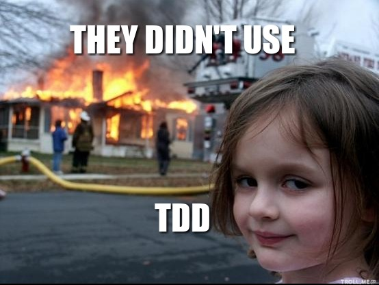

Exercício: 03 - Blackjack parte 01 - Grupo de Estudos Python
############################################################

:date: 2016-03-22 20:49
:tags: exercício, python, grupo de estudos python, sorocaba
:category: Python
:slug: exercicio-03-blackjack-parte-01-grupo-de-estudos-python
:author: Rafael Henrique da Silva Correia
:email:  rafael@abraseucodigo.com.br
:summary: Exercício para resolução passado no Grupo de Estudos Python

Como exercício desta semana gostaria que vocês começassem a implementação de um jogo de Blackjack, também conhecido como 21 (aqui no Brasil).

As regras do Blackjack que usaremos como base são essas da `Wikipédia <https://pt.wikipedia.org/wiki/Blackjack>`_. Também tem um joguinho pronto nos jogos da UOL que pode ser usado para entender melhor como é o jogo, `clique aqui <http://jogosonline.uol.com.br/blackjack_2654.html>`_ pra ver o jogo.

Recomendações
-------------

Como o jogo é complexo vamos fazer algumas regras primeiro, e em outro momento escrevemos outras, até terminar o jogo todo, BABY STEPS (passos de bebê, pé ante pé, bem devagar porém com segurança).

Lembre-se de usar a técnica de `TDD <https://pt.wikipedia.org/wiki/Test_Driven_Development>`_ para exercitar sua cabeça a pensar em testes, escreva sempre os testes primeiro para depois começar a programar algo realmente útil.

Utilize o módulo ``doctest`` do Python conforme mencionei na `Aula 05 <http://blog.abraseucodigo.com.br/video-05-grupo-de-estudos-python.html>`_ para escrever seus testes de maneira básica.

Ressalto aqui, o jogo não precisa estar pronto até o final! Escrevam testes para as funções mencionadas abaixo e as implemente. Nem precisa ter nada abaixo do ``if __name__ == "__main__"``.

O exercício
-----------

Na `aula 05 <http://blog.abraseucodigo.com.br/video-05-grupo-de-estudos-python.html>`_ nós já implementamos um baralho simples, conforme vemos o código abaixo:

.. code-block:: python

    # -*- coding: utf-8 -*-
    """
    Doctest deck

    >>> deck = create_deck()  # Test create_deck
    >>> len(deck)
    52
    >>> ten_firsts = deck[0:10]  # Test shuffle
    >>> shuffle(deck)
    >>> deck[0:10] != ten_firsts
    True
    """
    import random

    def create_deck():
        """This function create an deck with 52 cards"""
        numbers = ["A", "2", "3", "4", "5", "6",
                   "7", "8", "9", "10", "Q", "J",
                   "K"]
        suits = ["♣", "♦", "♥", "♠"]

        deck = []
        for suit in suits:
            for number in numbers:
                deck.append("{}{}".format(number, suit))
        return deck

    def shuffle(deck):
        """This function shuffle one deck"""
        deck = random.shuffle(deck)

    if __name__ == "__main__":
        deck = create_deck()
        shuffle(deck)
        print(deck)

** Também serve de exercício dar uma olhada nessas funções acima e refatorá-las, sempre da pra melhorar!

Como exercício implementem as funções abaixo:

1. função ``hit``: Nesta função você comprará cartas e irá sempre remover uma carta do baralho original, pois no momento que você compra uma carta a mesma não poderá existir mais no mesmo baralho (pista: dê uma lida na documentação do módulo `random <https://docs.python.org/3/library/random.html>`_);

2. função ``show_hand``: Nesta função você deverá mostrar quantas cartas você já comprou e quais são elas;

3. função ``show_points``: Nesta função você deverá mostrar quantos pontos acumulados você tem com as cartas que você já comprou;
    * Ás vale 1 ponto;
    * Cartas de números valem a mesma quantidade do número;
    * Cartas de figuras (K, J, Q) valem 10.

4. função ``surrender``: Mostra os pontos que você conseguiu até agora e finaliza a execução do jogo.

5. função ``show_money``: Mostrar seu saldo atual (em dinheiro), o saldo inicial deverá ser 2000 reais, que pode ser representado por uma variável simples que será lida como uma variável global ao longo de todo sistema;

6. função ``bet``: Esta é uma das funções mais complexas e legais do jogo, nela você deverá ver o seu saldo atual (em dinheiro) e comprar o número de fichas correspondentes com a aposta em dinheiro. Imagine assim:
    * Eu tenho 2000 reais iniciais;
    * Eu posso comprar fichas de 1, 5, 25 e 100 reais;
    * Eu posos comprar fichas (por enquanto) a hora que eu quiser e bem entender;
    * Se meu dinheiro for menor do que o valor em fichas que eu quero comprar, eu não posso comprar.

Acho que por enquanto essas 5 funções serão suficientes para o divertimento garantido hehehe. E não se esqueça: ESCREVA OS TESTES PRIMEIRO, ANTES DE SAIR PROGRAMANDO IGUAL UM MALUCO!

Senão...

** Sobre TDD aqui tem um texto muito bacana intitulado `TDD, por que usar? <http://tableless.com.br/tdd-por-que-usar/>`_

Em caso de dúvidas estou aqui para lhes auxiliar no processo, não deixem de me perguntar caso fiquem perdidos em algum ponto.

Gostaria MUITO que vocês terminassem este exercício até dia 28/03/2016 que vai ser a nossa próxima aula, sem fazer este exercício vocês não irão conseguir medir o quanto aprenderam até agora sobre Python.

Vamos considerar que esse é o primeiro exercício IMPORTANTE que passei pra vocês pois com ele vocês terão a possibilidade de usar TODOS os conhecimentos vistos até agora: Tipos básicos, Dicionários, Listas, Estrutura condicional, Estruturas de repetição, Testes (com doctest) e Funções.

Então... mãos a obra.

That's all folks.