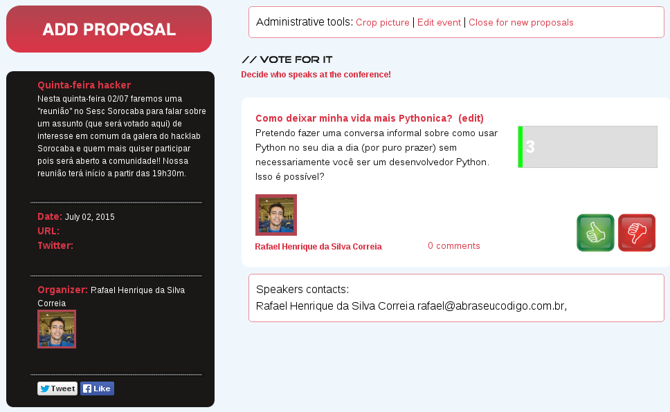

Grupo de Estudos Python Sorocaba
################################

:date: 2015-09-19 23:43
:tags: python, grupo de estudos python, sorocaba
:category: Python
:slug: grupo-de-estudos-python-sorocaba
:author: Rafael Henrique da Silva Correia
:email:  rafael@abraseucodigo.com.br
:summary: Grupo de estudos Python em Sorocaba aberto ao público em geral

Perto do dia 2 de julho de 2015 eu o Rafael Gottsfritz e o Caio Carrara tivemos a iniciativa de nos misturar ao `Hacklab Sorocaba <http://hacklab.club/>`_ para tentar organizar um grupo de estudos sobre variados assuntos.
Nós queríamos trazer mais movimento de comunidades para Sorocaba e regiões próximas, visto que isso é muitíssimo popular em cidades como Campinas, São Paulo e São José dos Campos:

- `Garoa Hacker Clube SP <https://garoa.net.br/wiki/P%C3%A1gina_principal>`_
- `Laboratório Hacker Campinas <http://lhc.net.br/wiki/P%C3%A1gina_principal>`_
- `RuPy Campinas 2015 <http://campinas.rupy.com.br/>`_
- `PG Day Campinas 2015 <http://pgdaycampinas.com.br/>`_
- `GruPy-SP <http://www.meetup.com/pt/Grupy-SP/>`_
- `TDC São Paulo 2015 <http://www.thedevelopersconference.com.br/tdc/2015/saopaulo/trilhas>`_
- `Pyladies Campinas - Facebook <https://www.facebook.com/pyladiescps>`_
- `Pyladies Campinas - Twitter <https://twitter.com/pyladiescps>`_
- `Python Brasil 2015 - SJC <http://pythonbrasil.github.io/pythonbrasil11-site/>`_

Esses links acima foram apenas exemplos de eventos de comunidade ou um pouco mais comerciais que rolaram/rolam ainda por este ano (2015).

O início
--------

Para tentar começar a trazer coisas legais pra Sorocaba, inicialmente divulguei na lista de `email do Hacklab <https://groups.google.com/forum/?hl=pt#!searchin/hackerspace-sorocaba/Sesc/hackerspace-sorocaba/ampID5hePrI/w0Jt_vIWSTEJ>`_ um bate-papo descontraído no SESC Sorocaba, era descontraído, mas para ter foco nessa "descontração" toda eu queria propor objetivos as conversas e que preferencialmente se baseasse em tecnologia (ou não, caso não tivessem muitos geeks na parada). 

Porém infelizmente (ou felizmente, ainda não descobri) somente EU coloquei um tema lá para discutir neste evento intitulado de "Quinta-feira Hacker" (o nome era bonito). Olha só que loucura que ficou o call4papers deste dia:

Bombando.... com `1 call somente <http://call4paperz.com/events/quinta-feira-hacker>`_!!

Inicialmente fiquei meio puto e imaginei que não ia aparecer ninguém no SESC, por fim foram várias pessoas (no mínimo umas 6 pelo que me recordo) ai eu fiquei mais feliz um pouco. Mas mesmo assim fiquei meio de queixo caído com o desinteresse geral das pessoas, pois eu chamei para o encontro no mínimo 50 e apareceram somente 6.

Hacklab no sábado (rolando ainda quase sempre)
----------------------------------------------

Alguns dias após este "big evento" fomos novamente os 6 mosqueteiros (quase todos que foram no SESC) no sábado para nos encontrar no `Museu de Arte Contemporânea de Sorocaba <http://www.macs.org.br/>`_, lá tem uma sala MUITO MUITO BACANA onde o pessoal faz umas reuniões embaixo do Museu (não amigo não é culto satânico.. é parada de hacker mesmo).

Neste dia conheci o Hudson que é o cara que toca o barco do Hacklab junto com o Guilherme que é um membro assíduo também, conversamos bastante e neste mesmo dia o Hudson me falou uma coisa importante que eu estava deixando passar...

``"Cara pra ser um evento precisa de você e mais um"``

Resumindo... acho que ele tinha razão, pois bastam 2 interessados para formar um pequeno grupo para fazer algo, se você estiver sozinho OK! Também é LEGAL! Porém você não tem o compromisso de estar na mesma hora no mesmo lugar para estudar algum assunto, imagino que isso seja o princípio da ideia de um `hackerspace <https://en.wikipedia.org/wiki/Hackerspace>`_.

O grupo de estudos
------------------

Eis que neste dia um pouco depois surgiu a ideia de montarmos um `Grupo de Estudos de Python em Sorocaba <https://groups.google.com/forum/#!forum/python-sorocaba>`_, um grupo com um caminho simples a trilhar:

1. Nivelar as pessoas em Python, para que discussões futuras sejam mais proveitosas (no ponto que estamos já estão sendo)
    - Para isso estou dando aulas eu mesmo via `Hangout on Air <http://www.google.com/intl/pt-BR_ALL/+/learnmore/hangouts/onair.html>`_

2. Todos nós aprendendo juntos
    - Existem assuntos bem complexos no mundo Python aos quais eu não domino para esses precisamos já ter entendido o básico e estarmos nivelados a ponto de aprendermos juntos

3. A parte mais legal!!!
    - Começar a contribuir ou criar projetos open source!!! Sem prazo nem cobranças.. fazer algo da legal que queremos pra aprendermos mais e mais

E o valor do curso!? O valor é DEDICAÇÃO E INTERESSE. Se você estiver afim de entrar no Grupo tem que ter no mínimo MUITA DEDICAÇÃO E MUITO INTERESSE pois é caro o curso em termos de valores honrosos hahaha.

Quer entrar para o nosso Grupo?? 
--------------------------------

Basta se inscrever na lista `Python-Sorocaba <https://groups.google.com/forum/#!forum/python-sorocaba>`_ e acompanhar os emails, sempre fazemos nossos encontros nas quartas-feiras a noite próximo das 20hrs.

Porém caso você queira entrar neste atual momento, agora, agorinha, me manda um tweet para que eu alinhe o que você precisa estudar, pois estamos indo para a aula 12 já. Mas podemos fazer novas aulas a partir da aula 1 se tiver mais gente interessada.

E ai curtiram a ideia?
