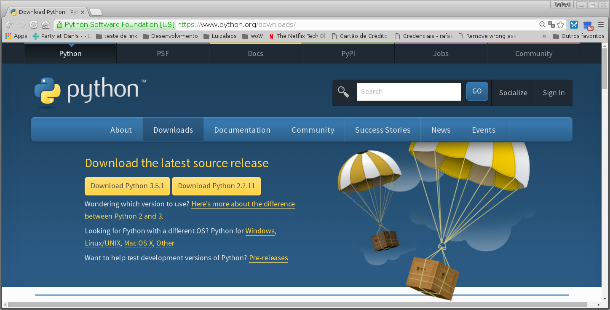
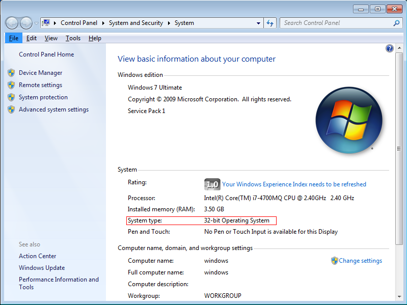
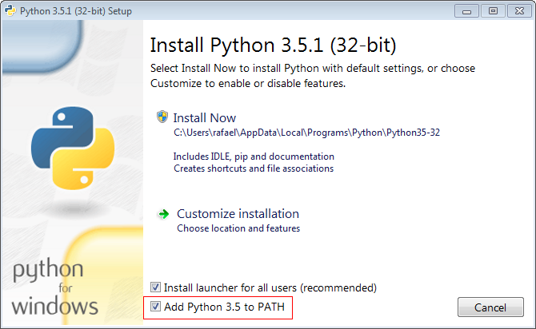
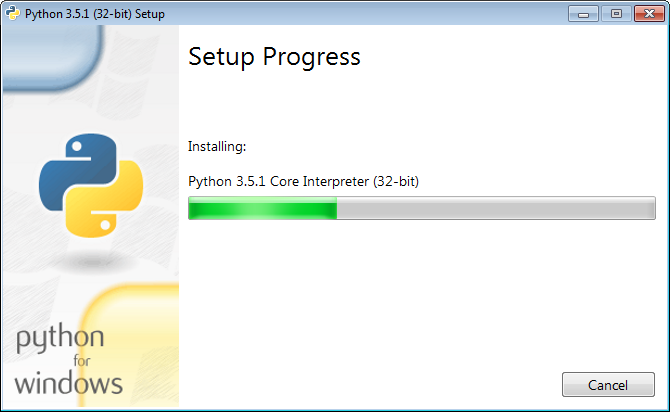
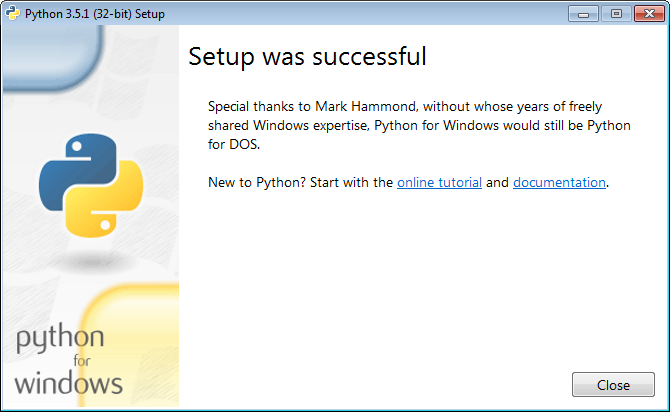
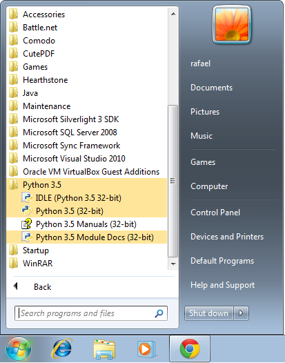

Instalando Python 3.5 no Windows 7
##################################

:date: 2016-02-16 21:09
:tags: python, windows, instalar python
:category: Python
:slug: instalando-python35-no-windows-7
:author: Rafael Henrique da Silva Correia
:email:  rafael@abraseucodigo.com.br
:summary: Muitos tem a dúvida de como instalar Python no Windows, hoje vou postar aqui um passo a passo bem básico pra que você consiga instalar Python3 no Windows 7

Muitos tem a dúvida de como instalar Python no Windows, hoje vou postar aqui um passo a passo bem básico pra que você consiga instalar Python3 no Windows 7.

Estou especificando as versões do Windows e a versão do Python pois como ambos evoluem com o tempo (e muito rapidamente) então creio eu que logo esse post irá ficar velho.

Ao escrever este post também tenho conhecimento que o Windows 10 é o Windows "da moda" porém neste momento só tenho uma máquina virtual de Windows 7 e estou sem tempo para criar uma máquina virtual de Windows 10, mas pelas pesquisas e googladas na internet creio que este post também será útil para outras versões do Windows.

Baixando o Python
-----------------

Você poderá baixar a versão oficial do Python neste site:

`https://www.python.org/downloads <https://www.python.org/downloads>`_

A página acessada será semelhante a esta:

Baixe a release 3.5.1 (disponível atualmente), se quiser baixar diretamente clique:

* `aqui para baixar a versão 32 bits <https://www.python.org/ftp/python/3.5.1/python-3.5.1.exe>`_.
* `aqui para baixar a versão 64 bits <https://www.python.org/ftp/python/3.5.1/python-3.5.1-amd64.exe>`_.

Recomendo verificar qual a arquitetura do seu sistema operacional para isso pressione as teclas ``Windows + Pause Break`` do seu teclado ou ``clique com o direito no ícone do Computador e posteriormente clique em propriedades``, a seguinte tela será apresentada:

Observe que eu grifei em vermelho a arquitetura do meu Windows instalado que é de 32 bits.

Instalando o Python
-------------------

Basicamente para instalar o Python depois de baixado clique duas vezes no executável baixado. A instalação é bem tranquila e bem next.. next.. finish.

Ao clicar duas vezes no executável a seguinte tela será aberta:

Repare que aqui nesta tela inicial o que é mais importante é marcar a opção ``Add Python3.5 to PATH`` desta forma você não precisará configurar as variáveis de ambiente do seu Windows posteriormente (pois isso é meio chato de se fazer manualmente). Marcada essa opção clique em ``Install Now``, ao clicar nesta opção o processo de instalação será iniciado:

Aguarde alguns instantes e esta outra tela será apresentada:

Feito isso clique em ``Close``, caso tenha algum problema nesta parte por favor me contate por email ou nos comentários abaixo deste post.

Conferindo quais programas você "ganhou"
----------------------------------------

Vejamos inicialmente o que instalamos:

* ``IDLE``: Uma IDE de linha de comando muito simples para começar suas aventuras no mundo Python;
* ``Python 3.5``: Irá abrir o interpretador do Python no seu ``Prompt de comandos``;
* ``Python 3.5 Manuals``: Toda a documentação do Python que está online `aqui <https://docs.python.org/3/>`_ ficará no seu computador para você acessar offline (para casos extremos onde você ficou sem internet).
* ``Python 3.5 Module Docs``: Uma referência sobre os módulos Python, ao clicar neste carinha será iniciado um servidorzinho que te servirá essa documentação, quando quiser sair basta ir ao console aberto e digitar ``q`` seguido de enter que o servidorzinho será desligado. 

Para começar seus estudos em Python é importante saber que a partir desta instalação você acaba de "ganhar" alguns programas que te ajudarão na sua jornada pelo conhecimento, alguns merecer destaque:

* ``pip``: Um poderoso gerenciador de pacotes/bibliotecas do Python, com ele você pode instalar muitas e muitas bibliotecas de terceiros;
* ``virtualenv``: Um cara "separador" de ambientes, não faz muito tempo este cara foi incorporado ao Python (antes ele era um cara fora do Python), ele serve para que você tenha diversas versões da mesma biblioteca para projetos diferentes sem que elas colidam e briguem entre si para ver qual a versão vai assumir e ficar a frente quando você chamar um ``import``.

Referência
----------

* `Documentação oficial do uso do Python no Windows <https://docs.python.org/3/using/windows.html>`_

Conclusão
---------

Não é difícil instalar Python no Windows, mas tem que se atentar a alguns detalhes bem simples. No próximo post pretendo descrever como e pra que serve o ``virtualenv`` e ``pip`` que você acabou de instalar.
