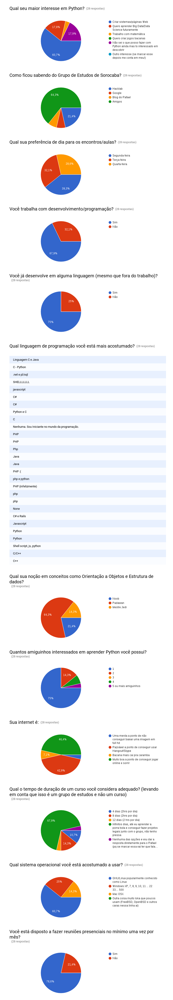

Pesquisa Grupo de Estudo Python Sorocaba
########################################

:date: 2016-02-20 13:02
:tags: python, grupo de estudos python sorocaba, sorocaba
:category: Python
:slug: pesquisa-grupo-de-estudo-python-sorocaba
:author: Rafael Henrique da Silva Correia
:email:  rafael@abraseucodigo.com.br
:summary: Semana passada criei um formulário do Google para fazer uma pesquisa com as pessoas interessadas no Grupo de Estudos Python Sorocaba, agora divulgo o resultado da pesquisa aqui no blog

Semana passada criei um formulário do Google para fazer uma pesquisa com as pessoas interessadas no Grupo de Estudos Python Sorocaba, agora divulgo o resultado da pesquisa aqui no blog. Ao todo tivemos 28 pessoas interessadas no grupo que responderam a pesquisa.

Com base nesses resultados vou iniciar na próxima segunda-feira um novo curso de Python para iniciantes.

Para novos membros do Grupo
---------------------------

Você ficou interessado em participar e não sabe como? Entre no grupo do Google `python-sorocaba <https://groups.google.com/forum/#!forum/python-sorocaba>`_ estou divulgando as novidades por lá.

Mas basicamente não tem mistério para poder participar, basta estar presente segunda-feira no Hangout (o link para acesso vou mandar no grupo python-sorocaba perto deste horário) a partir das 21hrs.

Não é necessário conhecimento prévio em Python, porém é necessário já conhecer alguma linguagem de programação ou pelo menos ter uma boa lógica em Algoritmos.

Resultado da pesquisa
---------------------

That's all folks!