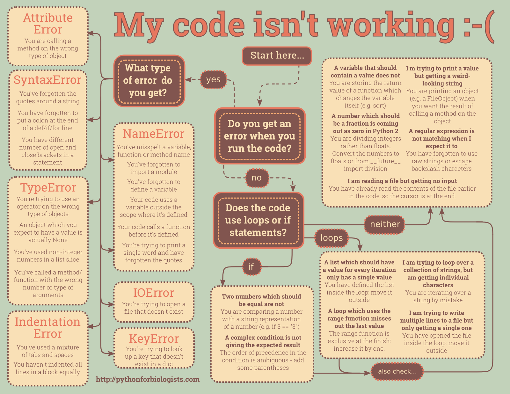

Resolução exercício: 01 - Calculadora básica - Grupo de Estudos Python
######################################################################

:date: 2016-03-16 20:54
:tags: exercício, python, grupo de estudos python, sorocaba, try, except, tratamento de exceções
:category: Python
:slug: resolucao-01-calculadora-basica-grupo-de-estudos
:author: Rafael Henrique da Silva Correia
:email:  rafael@abraseucodigo.com.br
:summary: Resolução do exercício calculadora básica usando um pouco de tratamento de exceções

Dia 29/02 postei um exercício para resolução, uma calculadora básica, o post contendo o enunciado pode ser `visto aqui <http://blog.abraseucodigo.com.br/exercicio-01-calculadora-basica-grupo-de-estudos-python.html>`_.

Resolução simples do exercício:

.. code-block:: python

    # -*- coding: utf-8 -*-

    primeiro = input("Digite o primeiro número: ")
    segundo = input("Digite o segundo número: ")
    operacao = input("Digite a operação: ")

    resultado = None
    if operacao == "+":
        resultado = float(primeiro) + float(segundo)
    elif operacao == "-":
        resultado = float(primeiro) - float(segundo)
    elif operacao == "*":
        resultado = float(primeiro) * float(segundo)
    elif operacao == "/":
        resultado = float(primeiro) / float(segundo)
    else:
        print("Operação não existente!")

    if resultado:
        print("Resultado: {0}".format(resultado))

Se executarmos este exercício passo a passo poderemos ver alguns problemas e curiosidades a respeito dele que podem ser aprimorados em relação ao código simples que escrevi acima. Problemas encontrados:

1. Se o usuário digitar uma letra isso irá causar uma exceção do tipo ValueError onde o Python informará que é impossível converter uma string em float;
2. A divisão por 0 também causará uma exceção, mas desta vez do tipo ZeroDivisionError.

Vamos visualizar estes erros na prática:

.. code-block:: console

    $ python calculadora.py 
    Qual operação deseja fazer? ( * / - +)
    *
    Digite operando1:
    a
    Digite operando2:
    a
    Traceback (most recent call last):
      File "calculadora00.py", line 16, in <module>
        resultado = float(operando1) * float(operando2)
    ValueError: could not convert string to float: 'a'

.. code-block:: console

    $ python calculadora.py 
    Qual operação deseja fazer? ( * / - +)
    /
    Digite operando1:
    1
    Digite operando2:
    0
    Traceback (most recent call last):
      File "calculadora00.py", line 18, in <module>
        resultado = float(operando1) / float(operando2)
    ZeroDivisionError: float division by zero

Como tratar estes erros de forma bem simples? Basta fazer algumas modificações, vejamos esta resolução que utiliza try / except:

.. code-block:: python

    # -*- coding: utf-8 -*-

    import sys
    operacao = input("Qual operação deseja fazer? ( * / - +)\n")

    try:
        operando1 = float(input("Digite operando1:\n"))
        operando2 = float(input("Digite operando2:\n"))
    except ValueError:
        print("Digite somente números nos operandos 1 e 2")
        sys.exit(1)

    resultado = None
    if operacao == "+":
        resultado = operando1 + operando2
    elif operacao == "-":
        resultado = operando1 - operando2
    elif operacao == "*":
        resultado = operando1 * operando2
    elif operacao == "/":
        try:
            resultado = operando1 / operando2
        except ZeroDivisionError:
            print("Operação inválida: Divisão por 0")
            sys.exit(1)
    else:
        print("Operação não existente!")

    if resultado:
        print("Resultado: {0}".format(resultado))

Neste código foram acrescentadas as estruturas try / except, focando especificamente nas exceptions ValueError e ZeroDivisionError.

Todo código entre o bloco try ao levantar uma exceção esta será verificada na chamada except, caso ela tenha o mesmo nome da exceção levantada o bloco except correspondente será executado. 

Acrescentei também a este código o import do módulo ``sys`` para usar o método ``sys.exit(1)`` que finaliza o script com um retorno de erro (1).

No Python temos uma infinidade de exceções para tratamento dos mais variados erros, porém esses dias "passeando" pelo Twitter encontrei uma imagem bem interessante que desenha um fluxograma explicando as principais exceptions que acontecem no Python (enquanto você está programando, geralmente), veja a imagem:

Esta imagem da uma noção bem bacana de como analisar erros comuns no Python. Abaixo deixo outra versão do código que também funcionaria tranquilamente, mas desta vez verificando se o operando 2 é um número 0:

.. code-block:: python

    # -*- coding: utf-8 -*-

    import sys
    operacao = input("Qual operação deseja fazer? ( * / - +)\n")

    try:
        operando1 = float(input("Digite operando1:\n"))
        operando2 = float(input("Digite operando2:\n"))
    except ValueError:
        print("Digite somente números nos operandos 1 e 2")
        sys.exit(1)

    resultado = None
    if operacao == "+":
        resultado = operando1 + operando2
    elif operacao == "-":
        resultado = operando1 - operando2
    elif operacao == "*":
        resultado = operando1 * operando2
    elif operacao == "/" and operando2 == 0:
        print("Operação inválida: Divisão por 0")
        sys.exit(1)
    elif operacao == "/":
        resultado = operando1 / operando2
    else:
        print("Operação não existente!")

    if resultado:
        print("Resultado: {0}".format(resultado))

Conclusão
---------

Informação impotantíssima: Todo erro se torna um problema desde que não seja tratado adequadamente, então, sempre tenha em mente quando usar try / except em seu código.

E ai gostaram? Deixem suas críticas/sugestões e dúvidas abaixo do post e lembre-se que nenhuma dúvida é ruim, o ruim é você permanecer com ela.

That's all folks!
