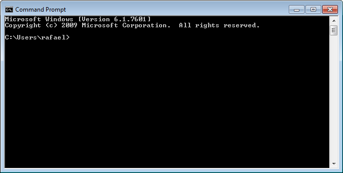
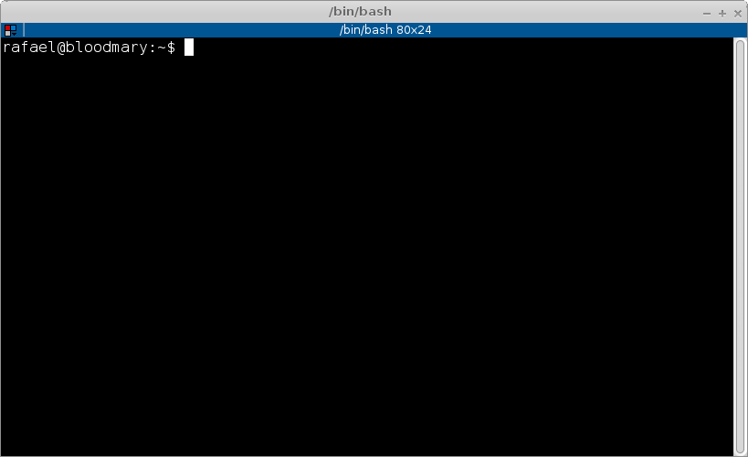

virtualenv/pip pra que servem?
##############################

:date: 2016-02-17 21:18
:tags: python, virtualenv, pip
:category: Python
:slug: virtualenv-pip-pra-que-servem
:author: Rafael Henrique da Silva Correia
:email:  rafael@abraseucodigo.com.br
:summary: Existem muitos posts pela internet afora dizendo como usar virtualenv e pip, e realmente é muito fácil. Mas para um iniciante a pergunta que vem a mente é... pra que serve virtualenv? Pra que serve pip?

Existem muitos posts pela internet afora dizendo como usar virtualenv e pip, e realmente é muito fácil. Mas para um iniciante a pergunta que vem a mente é... pra que serve virtualenv? Pra que serve pip?

Explicando para quem nunca desenvolveu em Python
------------------------------------------------

Imagine que você tem um programa na sua máquina em uma versão 1.0.0 e em dado momento você quer instalar a versão 1.0.1, porém, você também precisa da versão 1.0.0 pois você tem algum arquivo que não abre na versão mais nova.

Pois é, este problema também acontece com os desenvolvedores Python, e a solução criada para este problema foi o nosso amigo ``virtualenv``. 

O virtualenv
------------

Uilizando o ``virtualenv`` você consegue isolar as bibliotecas do projeto A em relação ao projeto B.

Imagine que em determinado momento que o projeto A começou a ser desenvolvido você ainda não tinha Python3 e optou por usar Python2 e mais um monte de bibliotecas do Python2, porém o projeto B usa Python3 e obviamente você não vai querer usar as bibliotecas do Python2 pois você deu uma evoluída nesse projeto e quer usar tudo que existe de mais novo no mundo Python.

Já imaginou a bagunça que seu sistema operacional vai fazer? O S.O. vai colocar a versão antiga e a nova no mesmo diretório e quando você chamar o comando `import` do Python para importar sua biblioteca você sempre ficará em dúvida de qual a versão você importou. Isso vira um caos com o passar do tempo, principalmente depois de você instalar muitas bibliotecas. 

Apenas fazendo um comentário pertinente, biblioteca também pode ser chamadas de módulos em Python e vice-versa. Estou chamando de biblioteca pois fica mais fácil para as pessoas que vem de outras linguagens entenderem. 

O pip
-----

Falei um pouco sobre ``virtualenv``, mas e o ``pip``? 

O ``pip`` é o "gerenciador de pacotes" do Python. Assim como o `apt-get <https://www.debian.org/doc/manuals/apt-howto/ch-apt-get.pt-br.html>`_ e o `homebrew <http://brew.sh/>`_ que são os gerenciadores de pacotes do Ubuntu/Mac OSX o `pip <https://pypi.python.org/pypi/pip>`_ é o instalador de bibliotecas de terceiros padrão do Python.

Com o pip você poderá instalar qualquer biblioteca disponível no famoso site de bibliotecas da Python Software Foundation o `PyPi <https://pypi.python.org/pypi>`_. Eu não tenho ideia de como verificar quantas bibliotecas Python existem hoje no PyPi, mas posso dizer que são centenas, ou milhares! São muitos MESMO, para os mais variados fins.

Hands-on 
--------

Vamos criar um projeto chamado ``myprojectA`` e outro chamado ``myprojectB`` para demonstrar o uso do isolamento de ambientes que ``virtualenv`` nos ajuda a fazer, também iremos instalar bibliotecas com o ``pip`` durante o processo.

Para executar este passo a passo estou usando Python 3.5.X:

* Se você não tem Python 3.5.X instalado e usar Windows clique `aqui <http://blog.abraseucodigo.com.br/instalando-python35-no-windows-7.html>`_ para ir ao post que escrevi ontem descrevendo este procedimento;
* Se você não tem Python 3.5.X instalado e usar Linux ou Mac OSX você poderá usar o apt-get, yum ou homebrew para instalar Python3.5.X no seu computador de forma absolutamente simples, porém ainda não fiz posts sobre isso.

No Windows vou abrir o ``Prompt de comandos`` que terá essa cara:

Onde ``rafael`` é meu nome de usuário e o caminho padrão que usarei é ``C:\Users\rafael``.

No Linux/Mac OSX vamos abrir um terminal que terá esta aparência:

Onde ``rafael`` também é meu nome de usuário e o caminho padrão que usarei é ``/home/rafael``.

Clique abaixo para continuar o procedimento relativo ao seu sistema operacional:  

* `Criando virtualenv e utilizando o pip no Windows`_
* `Criando virtualenv e utilizando o pip no Linux e Mac OSX`_

Criando virtualenv e utilizando o pip no Windows
------------------------------------------------

Vamos criar o diretório do projeto ``myprojectA``:

.. code-block:: command

    C:\Users\rafael> mkdir myprojectA

Vamos entrar nesta pasta:

.. code-block:: command

    C:\Users\rafael> cd myprojectA
    C:\Users\rafael\myprojectA>

Posteriormente vamos criar um virtualenv:

.. code-block:: command

    C:\Users\rafael\myprojectA> python -m venv .venv

Pronto criamos um virtualenv onde este cara ficará armazenado em uma pasta nomeado como `.venv`, como podemos ver abaixo:

.. code-block:: command

    C:\Users\rafael\myprojectA> dir
    ... linhas omitidas ...

    02/16/2016   10:36 PM   <DIR>        .venv

    ... linhas omitidas ...

Para começar a usar esse virtualenv temos que ativá-lo para isso execute:

.. code-block:: command

    C:\Users\rafael\myprojectA> .venv\Scripts\activate.bat
    (.venv) C:\Users\rafael\myprojectA>

Perceba que o seu prompt vai ser modificado e o prefixo (.venv) será acrescentado no começo dele. Agora vamos instalar uma biblioteca, o ipython:

.. code-block:: command

    (.venv) C:\Users\rafael\myprojectA> pip install ipython

O ``ipython`` tem várias dependências (que irão ser instaladas juntamente com ele, não se assuste) e sua função é seu um interpretador do Python com mais recursos. Quando eu não passo uma versão específica ao ``pip`` ele vai instalar sempre a última versão estável da biblioteca, no momento que instalei no meu computador a versão corrente era a 4.1.1. Então neste projeto que chamei de ``myprojectA`` teremos as seguintes bibliotecas:

.. code-block:: command
    
    (.venv) C:\Users\rafael\myprojectA> pip freeze
    decorator==4.0.9
    ipython==4.1.1
    ipython-genutils==0.1.0
    path.py==8.1.2
    pickeshare==0.6
    simplegeneric==0.8.1
    traitlets==4.1.0

Com o comando acima ``pip freeze`` veremos todas as bibliotecas instaladas nesse ``virtualenv`` e suas respectivas versões. Não vou detalhar neste post todos os poderes do ``pip``, mas o parâmetro ``freeze`` é extremamente importante para o desenvolvimento de sistemas em Python, futuramente posso fazer um post só explicando setup de projetos Python, se quiserem esse post rápido me dêem um toque ai nos comentários.

Para não ser muito repetitivo (`DRY <https://en.wikipedia.org/wiki/Don%27t_repeat_yourself>`_) no post e para aplicar um exercício de fixação ao mesmo tempo, refaça os passos com o diretório ``myprojectB`` mas antes disso desative o ``virtualenv`` atual:

.. code-block:: command

    (.venv) C:\Users\rafael\myprojectA> .venv\Scripts\deactivate.bat

Ao chegar no passo em que você instala o ``ipython`` pelo ``pip`` não faça isso desta vez, quando chegar nesta etapa execute o comando abaixo:

.. code-block:: command

    (.venv) C:\Users\rafael\myprojectB> pip install ipython==3.0.0

Desta forma vamos testemunhar o isolamento de ambientes! Ao terminar a instalaçào do ``ipython`` (versão 3.0.0), verifique o que você acabou de instalar:

.. code-block:: command

    (.venv) C:\Users\rafael\myprojectB> pip freeze
    ipython=3.0.0

Ai você vai me perguntar "ué!? cadê os requisitos!?" pois é... nesta versão do ``ipython`` ele não tinha tantos requisitos, só por essa demonstração já conseguimos ver o isolamento entre os ambientes.

Criando virtualenv e utilizando o pip no Linux e Mac OSX
--------------------------------------------------------

Vamos criar o diretório do projeto ``myprojectA``:

.. code-block:: command

    rafael@bloodmary:~$ mkdir myprojectA

Vamos entrar nesta pasta:

.. code-block:: command

    rafael@bloodmary:~$ cd myprojectA
    rafael@bloodmary:myprojectA$

Posteriormente vamos criar um virtualenv:

.. code-block:: command

    rafael@bloodmary:myprojectA$ python3.5 -m venv .venv

Pronto criamos um virtualenv onde este cara ficará armazenado em uma pasta nomeado como `.venv`, como podemos ver abaixo:

.. code-block:: command

    rafael@bloodmary:myprojectA$ ls -a
    .  ..  .python-version  .venv

Para começar a usar esse virtualenv temos que ativá-lo para isso execute:

.. code-block:: command

    rafael@bloodmary:myprojectA$ source .venv/bin/activate
    (.venv)rafael@bloodmary:myprojectA$

Perceba que o seu prompt vai ser modificado e o prefixo (.venv) será acrescentado no começo dele. Agora vamos instalar uma biblioteca, o ipython:

.. code-block:: command

    (.venv)rafael@bloodmary:myprojectA$ pip install ipython

O ``ipython`` tem várias dependências (que irão ser instaladas juntamente com ele, não se assuste) e sua função é seu um interpretador do Python com mais recursos. Quando eu não passo uma versão específica ao ``pip`` ele vai instalar sempre a última versão estável da biblioteca, no momento que instalei no meu computador a versão corrente era a 4.1.1. Então neste projeto que chamei de ``myprojectA`` teremos as seguintes bibliotecas:

.. code-block:: command
    
    (.venv)rafael@bloodmary:myprojectA$ pip freeze
    decorator==4.0.9
    ipython==4.1.1
    ipython-genutils==0.1.0
    path.py==8.1.2
    pexpect==4.0.1
    pickleshare==0.6
    ptyprocess==0.5.1
    simplegeneric==0.8.1
    traitlets==4.1.0
    wheel==0.24.0

Com o comando acima ``pip freeze`` veremos todas as bibliotecas instaladas nesse ``virtualenv`` e suas respectivas versões. Não vou detalhar neste post todos os poderes do ``pip``, mas o parâmetro ``freeze`` é extremamente importante para o desenvolvimento de sistemas em Python, futuramente posso fazer um post só explicando setup de projetos Python, se quiserem esse post rápido me dêem um toque ai nos comentários.

Para não ser muito repetitivo (`DRY <https://en.wikipedia.org/wiki/Don%27t_repeat_yourself>`_) no post e para aplicar um exercício de fixação ao mesmo tempo, refaça os passos com o diretório ``myprojectB`` mas antes disso desative o ``virtualenv`` atual:

.. code-block:: command

    (.venv)rafael@bloodmary:myprojectA$ deactivate

Ao chegar no passo em que você instala o ``ipython`` pelo ``pip`` não faça isso desta vez, quando chegar nesta etapa execute o comando abaixo:

.. code-block:: command

    (.venv)rafael@bloodmary:myprojectB$ pip install ipython==3.0.0

Desta forma vamos testemunhar o isolamento de ambientes! Ao terminar a instalaçào do ``ipython`` (versão 3.0.0), verifique o que você acabou de instalar:

.. code-block:: command

    (.venv) rafael@bloodmary:myprojectB$ pip freeze
    ipython==3.0.0

Ai você vai me perguntar "ué!? cadê os requisitos!?" pois é... nesta versão do ``ipython`` ele não tinha tantos requisitos, só por essa demonstração já conseguimos ver o isolamento entre os ambientes.

Conclusão
---------

``pip`` e ``virtualenv`` são dois "utilitários" muito bacanas do Python, eles te ajudam muito na hora de criar qualquer projeto em Python, espero que esse post seja útil, apesar de ter ficado bem grandinho, mas é que tinha muita coisa pra escrever mesmo e ainda ficou faltando coisa.

Referências bacanas
-------------------

* `Explicação sobre Ambiente Virtual contida na página do Garoa Hacker Clube de SP <https://garoa.net.br/wiki/Python/Ambiente_Virtual>`_
* `Documentação oficial do virtualenv <http://virtualenv.readthedocs.org/en/latest/index.html>`_
* `Documentação oficial do virtualenvwrapper <https://virtualenvwrapper.readthedocs.org/en/latest/>`_
* `Documentação oficial do Python explicando sobre virtualenv <https://docs.python.org/3/library/venv.html>`_